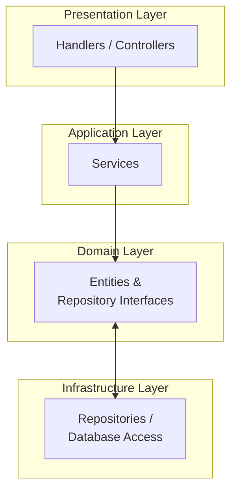
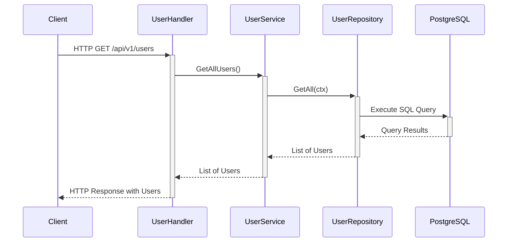
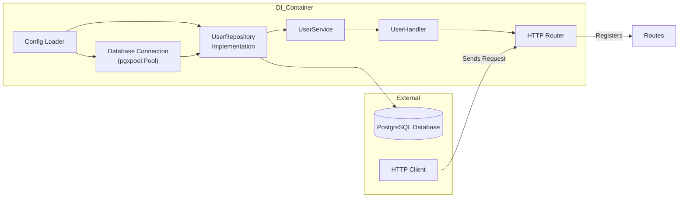
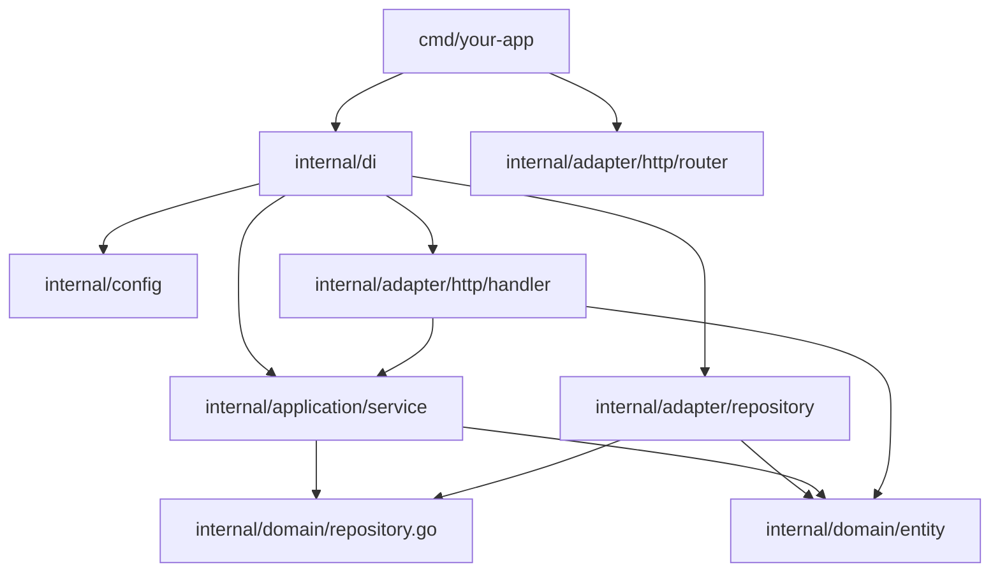
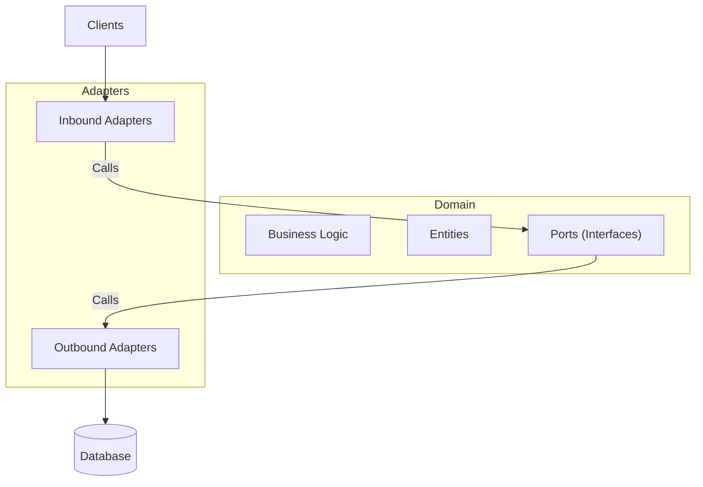

### High-level Architecture
This diagram shows the overall structure of your application's layers and their interactions.

Explanation:

- Handlers / Controllers (A) in the Presentation Layer call the Services (B) in the Application Layer.
- Services (B) interact with Entities and Repository Interfaces (C) in the Domain Layer.
- The Domain Layer (C) defines the Repository Interfaces, which are implemented by the Repositories (D) in the Infrastructure Layer.
- The Infrastructure Layer (D) communicates back to the Domain Layer (C) by fulfilling the repository contracts.



### Sequence for "Get all Users"



### Diagram with Dependecy Injection



### Package Structure Diagram



### Hexagonal Architecture Diagram



### Clean Architexture Diagrama

```
TO-DO
```
