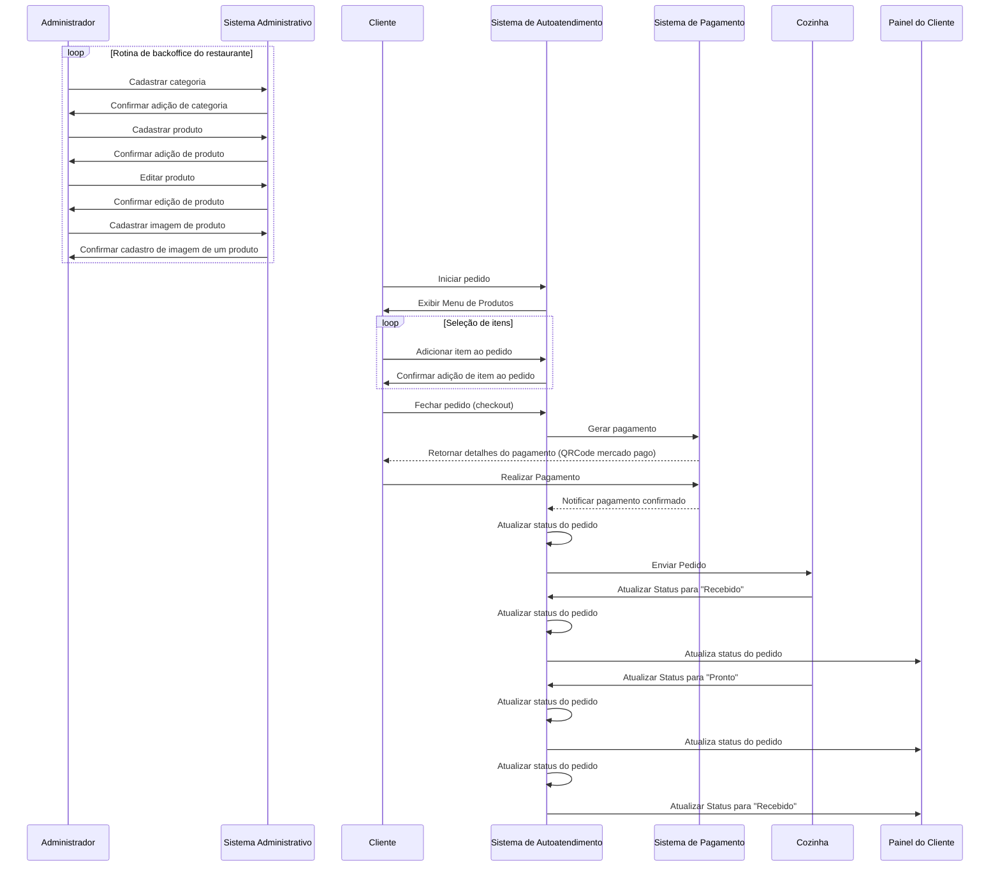

# Tech Challenge [Fase 2]

## Resultado no minikube


```bash
> kubectl get all
NAME                                  READY   STATUS    RESTARTS   AGE
pod/restaurant-api-5776d57fc9-8fln4   1/1     Running   0          2m20s
pod/restaurant-db-5ffddf874-2nm2x     1/1     Running   0          4m33s

NAME                             TYPE        CLUSTER-IP      EXTERNAL-IP   PORT(S)          AGE
service/kubernetes               ClusterIP   10.96.0.1       <none>        443/TCP          8m59s
service/restaurant-api-service   NodePort    10.96.134.181   <none>        8080:30000/TCP   106s
service/restaurant-db-service    ClusterIP   None            <none>        5432/TCP         2m42s

NAME                             READY   UP-TO-DATE   AVAILABLE   AGE
deployment.apps/restaurant-api   1/1     1            1           2m20s
deployment.apps/restaurant-db    1/1     1            1           4m33s

NAME                                        DESIRED   CURRENT   READY   AGE
replicaset.apps/restaurant-api-5776d57fc9   1         1         1       2m20s
replicaset.apps/restaurant-db-5ffddf874     1         1         1       4m33s

NAME                                                     REFERENCE                   TARGETS       MINPODS   MAXPODS   REPLICAS   AGE
horizontalpodautoscaler.autoscaling/restaurant-api-hpa   Deployment/restaurant-api   cpu: 1%/50%   1         5         1          100s
```

# Documentação do Projeto

Este documento detalha o desenho da arquitetura do sistema, elaborado para atender aos requisitos do negócio e às necessidades de infraestrutura.

`mermaid` que ilustra um diagrama de sequências, simples, que demonstra como a aplicação conseguirá resolver os problemas funcionais do projeto:



---

## 1. Requisitos do Negócio

O restaurante enfrenta problemas de performance nos seus totens de autoatendimento, que comprometem a experiência do usuário durante picos de demanda. Os principais objetivos da solução são:

- **Garantir disponibilidade** do sistema durante períodos de alta carga.
- **Reduzir o tempo de resposta** das requisições realizadas pelos totens.
- **Permitir escalabilidade automática** para lidar com flutuações no volume de requisições.

---

## 2. Requisitos de Infraestrutura

A arquitetura foi projetada para ser implantada em um cluster Kubernetes, podendo ser executada em:

- **Ambientes locais**, como Minikube ou Kind.
- **Provedores de nuvem**, como AKS (Azure), EKS (AWS), ou GKE (Google Cloud).

**Principais elementos da infraestrutura:**

- **Horizontal Pod Autoscaler (HPA):** Configurado para escalar automaticamente a aplicação "restaurant-api" com base no uso de CPU, garantindo que os recursos sejam alocados conforme a demanda.
- **Secrets:** Utilizados para armazenar credenciais sensíveis, como a URL de conexão do banco de dados.
- **Banco de Dados PostgreSQL:** Implantado como um deployment com um PersistentVolumeClaim (PVC) para persistência de dados.
- **Aplicação em GO (atendendno os requisitos funcionais):** Implantado como um deployment que utiliza de um secrets para ter as credenciais de acesso ao Banco de Dados.
- **Services:** Configurados para expor a aplicação e o banco de dados, incluindo um NodePort para acesso externo à API.
- **ConfigMap:** Armazena configurações de aplicação não sensíveis, permitindo flexibilidade sem alterar a imagem do container.

---

## 3. Desenho da Arquitetura

### Representação Textual

1. **Aplicação (restaurant-api):**
  - Uma API desenvolvida em Go, responsável por processar as requisições dos totens.
  - Configurada com um **Deployment** que especifica recursos mínimos e máximos para evitar sobrecarga.
  - Utiliza o HPA para escalar de 1 a 5 réplicas com base na utilização de CPU.
  - Verificação de saúde implementada com liveness e readiness probes.

2. **Banco de Dados (restaurant-db):**
  - PostgreSQL configurado com um **Deployment** e com **PVC** para garantir a persistência dos dados.

3. **Horizontal Pod Autoscaler (HPA):**
  - Monitora a métrica de utilização de CPU da "restaurant-api" e ajusta dinamicamente o número de réplicas.

  Aqui podemos ver ele em funcionamento (ps: o computador que foi gravado dá um engargalada por conta do uso de memória, além de estar rodando no wsl e um minikube no docker com limitações), e para que funcionasse foi criado um shell script que exonera a api, aumentando o recurso consumido pelo container.

  https://github.com/user-attachments/assets/8789e2c1-4d21-4c41-a1e8-db7333b53e48

4. **ConfigMap:**
  - Armazena configurações não sensíveis, como variáveis de ambiente e parâmetros de configuração, que podem ser usadas para configurar dinamicamente seus aplicativos sem alterar o código ou reconstruir imagens de contêineres.

5. **Secrets:**
  - Protegem informações sensíveis como a URL de conexão ao banco de dados. Estes dados são consumidos pela aplicação "restaurant-api" via variáveis de ambiente. O Secret utilizado é:

6. **Exposição de Serviços:**
  - **NodePort** para a "restaurant-api" permite acesso externo na porta 30000+.
  - O banco de dados é acessível internamente via **ClusterIP**.

### Diagrama da Arquitetura


---

## 4. Benefícios da Arquitetura

- **Escalabilidade Automática:** O HPA ajusta dinamicamente os recursos da aplicação conforme a carga.
- **Alta Disponibilidade:** Configurações de readiness e liveness probes garantem que apenas pods saudáveis recebam tráfego.
- **Segurança:** Uso de Secrets para proteger informações sensíveis.
- **Flexibilidade:** ConfigMaps permitem alterações rápidas nas configurações da aplicação sem necessidade de recriar imagens.
- **Persistência de Dados:** O banco de dados utiliza PVC para garantir que os dados sejam preservados mesmo em caso de falhas.

---

Este design assegura que a aplicação seja confiável, escalável e responsiva para atender aos desafios do restaurante.

---

## 5. Como rodar o cluster localmente

Para detalhes, consulte o arquivo [how-to-tun-k8s.md](../how-to-run-k8s.md).

**OBS**: Todos os manifetos se emcontram em [./k8s](../../k8s/).

## 6. Collection com todas as APIs desenvolvidas com exemplo  de requisição (que não seja vazia)

- Para swagger, a documentação se encontra em `./swagger/* (tanto .json quanto o .yaml)`.
- Para postaman, a collection se encontra em `./postman/fiap_collection.json`.

## 7. como rodar a aplicação locamente

Para detalhes, consulte o arquivo [how-to-run.md](../how-to-run.md).

## 8. Link para vídeo de demonstração

[Link do vídeo não listado no YouTube](https://youtu.be/1eFxO6Mjl7A).

## 9. Dados da arquitetura limpa e suas pastas aplicadas no projeto

Para detalhes, consulte o arquivo [infra.md](../infra.md).

## 10. Informações relacionadas a fase 1

Para detalhes, consulte o arquivo [phase-1.md](./phase-1.md).
