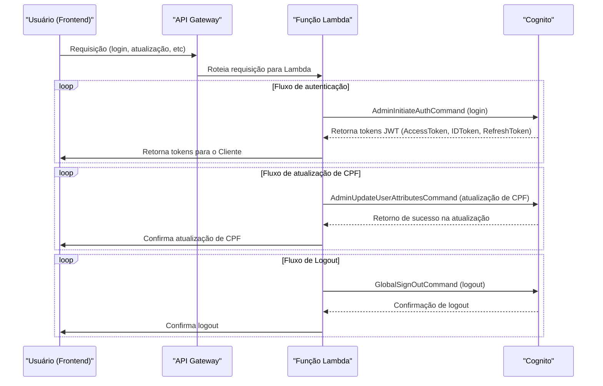

# Tech Challenge [Fase 3]

[Vídeo de entrega da fase 3](https://youtu.be/6J4QaEhm38k).

## Entregáveis.

Focando no que é considerado entregável para esta etapa, dado que nesta fase do projeto, foram realizadas melhorias e alterações conforme os requisitos definidos. Abaixo estão os entregáveis organizados e numerados:

### 1. Implementação de API Gateway e Function Serverless.

#### a. Integrar ao sistema de autenticação para identificar o cliente.

##### Arquitetura da Solução.

A arquitetura da solução inclui:

**API Gateway**: Expõe as APIs de autenticação e roteia requisições para a função serverless.
**Function Serverless (AWS Lambda)**: Processa a autenticação do cliente com base no CPF.
**AWS Cognito**: Serviço de autenticação e autorização que gerencia usuários e valida credenciais.
**Route 53 + ACM**: Configuração de domínio personalizado para a API.

##### Configuração do Cognito.

A autenticação dos usuários é gerenciada pelo AWS Cognito, conforme definido no arquivo cognito.tf. As principais configurações incluem:

1. User Pool: Criado para armazenar e gerenciar usuários.
2. Autenticação via CPF: O CPF é usado como identificador único, configurado como um atributo customizado (custom:cpf).
3. Política de Senhas: Requer no mínimo 8 caracteres, incluindo números, símbolos e letras maiúsculas e minúsculas.
4. MFA Opcional: O usuário pode ativar autenticação multifator via TOTP (Time-based One-Time Password).
5. Recuperação de Conta: Pode ser feita via telefone ou e-mail.

##### Configuração de Tokens:

1. Token de acesso válido por 1 hora.
2. Token de ID válido por 1 hora.
3. Refresh Token válido por 30 dias.
4. Configuração do API Gateway

##### O API Gateway gerencia todas as requisições de autenticação, conforme definido em routes.tf. As principais rotas incluem:

1. POST /auth/register → Cadastro de novos usuários.
2. POST /auth/login → Login tradicional com e-mail e senha.
3. POST /auth/login/cpf → Login via CPF.
4. GET /auth/user/cpf/{cpf} → Recuperação de dados do usuário pelo CPF.
5. POST /auth/token → Geração de novo token JWT.
6. POST /auth/forgot-password → Esqueci minha senha.
7. POST /auth/reset-password → Reset de senha.
8. POST /auth/change-password → Alteração de senha.
9. POST /auth/logout → Logout do sistema.

##### Configuração de Domínio Personalizado.

O domínio personalizado para a API é configurado via Route 53 e ACM, conforme definido em domain.tf. Principais recursos:

1. Certificado SSL (ACM): Criado e validado via DNS para auth.tadeutupinamba.com.br.
2. Registro DNS (Route 53): Entrada A criada para apontar para o API Gateway.
3. Mapeamento no API Gateway: Definição do domínio personalizado para o estágio da API.
4. Configuração da Infraestrutura via Terraform
5. O Terraform provisiona todos os recursos, conforme definido em main.tf. Principais configurações:
6. S3 Backend: Armazena o estado do Terraform para controle de mudanças.
7. Lambda Deployment: Empacotamento do código e envio para a AWS.
8. IAM Roles: Configuração de permissões para Lambda interagir com Cognito e CloudWatch.

##### Monitoramento:

1. Logs do API Gateway no CloudWatch.
2. Logs da Lambda no CloudWatch.
3. Variáveis da Infraestrutura

##### Os valores dinâmicos são definidos no arquivo variables.tf. Algumas principais variáveis:

1. aws_region → Região AWS onde os recursos são implantados (us-east-1).
2. lambda_name → Nome da função Lambda (auth-service-lambda).
3. lambda_runtime → Ambiente de execução (nodejs18.x).
4. lambda_memory → Memória alocada para a Lambda (256MB).
5. lambda_timeout → Tempo máximo de execução (30s).
6. log_retention_days → Tempo de retenção de logs no CloudWatch (30 dias).

### 2. Implementar as melhores práticas de CI/CD para a aplicação, segregando os códigos em repositórios.

Estas são as seguintes regras e padrões que foram usados como boas práticas:

##### 1. Estrutura de Projeto.

- **Organização por módulos**: Foi usado módulos Terraform para separar e reutilizar a configuração de infraestrutura. Exemplo: um módulo para EKS, outro para Lambda e outro para API Gateway.

##### 2. Gerenciamento de Estado.

- **Estado remoto**: Usado o backend remoto para armazenar o estado do Terraform, como o `S3`.
- **Criptografia do estado**: Habilitado a criptografia no `S3` para proteger o estado.

## 3. Qualidade da Versão.

- **`terraform fmt` e `terraform validate`**: Antes de realizar o deploy, o código deve ser formatado com `terraform fmt` e validado a configuração com `terraform validate` para garantir que a sintaxe e a estrutura estão corretas.

## 4. Autenticação e Autorização.

- **Princípios do IAM**: Definido roles e permissões baseadas em privilégios mínimos, garantindo que cada serviço tenha acesso apenas ao que é necessário.

## 5. Módulos e Recursos.

- **Evitado hardcoding de valores**: Evitado hardcode de valores no código Terraform (como credenciais ou IDs de recursos). Usado variáveis e arquivos como `variables.tf`.
- **Utilizado output para referência de recursos**: Utilizadp outputs para pegar informações de recursos criados por um módulo e usá-los em outro.

## 6. EKS.

- **Automação de deployments**: `kubectl` para automatizar o deployment de aplicações dentro do EKS.
- **Configuração de auto-scaling**: Configurado auto-scaling para os nodes do EKS e também para os pods, ajustando automaticamente os recursos conforme a carga.
- **Monitoramento e logging**: Habilitado o Amazon CloudWatch para coletar logs e métricas do cluster EKS.

## 7. Lambda.

- **Gerenciado a versão do código da Lambda**: Usado variáveis para definir a versão do código da Lambda e atualizado conforme necessário.
- **Timeout e memória**: Definido corretamente o timeout e a memória da Lambda com base na carga e tipo de processamento.
- **Gerenciamento de variáveis de ambiente**: Evitado hardcode de variáveis dentro do código Lambda e use variáveis de ambiente para gerenciar configurações e segredos.

## 8. API Gateway.

- **Defina recursos e métodos de maneira clara**: Usado o API Gateway para criar recursos RESTful de forma organizada.
- **Implementação de CORS**: Configurado o CORS adequadamente no API Gateway.
- **Integração com Lambda**: Lógica abstraída para o lambda.
- **Autenticação e Autorização**: Usado o Amazon Cognito para proteger suas APIs.

## 9. Segurança.

- **Criptografia de dados**: Usado sempre criptografia para dados em repouso (S3, RDS) e em trânsito (TLS).
- **Políticas de IAM restritivas**: Criado políticas de IAM o mais restritivas possível para cada recurso e serviço.

## 10. Testes e Validação.

- **Plano de execução (`terraform plan`)**: Usado o `terraform plan` antes de aplicar as mudanças, isso garante que você está ciente do que será alterado.

## 11. CI/CD e Automação.

- **Pipeline de CI/CD**: Integrado Terraform com pipeline de CI/CD para automação de deploy (GitHub Actions).

## 12. Contextos.

- Mesmo que foi usado somente um repositório contendo todas as informações, elas estaõ separadas em contextos, como o `auth-service`, que é isolado da aplicação princial, e seu deploy só é engatilhado com alterações na aplicação ou em sua camada de infraestrutura, assim como as outras camadas no `terraform`.

- [auth-service](./auth-service/terraform/)
- [k8s](./k8s/)
- [infra-database](./k8s/deployment-db.yml)
- [terraform-geral](./terraform/)

### 3. Os repositórios devem fazer deploy automatizado na conta da nuvem utilizando actions. As branchs main/master devem ser protegidas, não permitindo commits direto.

- **Action auth-service**: [here](./.github/workflows/auth-service-deploy.yml)
- **Action eks**: [here](./.github/workflows/deploy-to-eks.yml)
- **Action terraform**: [here](./.github/workflows/terraform-eks.yml)

### 4. Melhorar a estrutura do banco de dados escolhido, documentar seguindo os padrões de modelagem de dados e justificar a escolha do banco de dados.

#### Remoção de tabelas desnecessárias que foram criadas anteriormente.

Basicamente removemos camadas que não tem utilização da área de negócio e nem implicações técnicas, com o propósito de reduzir o custo com storage, e melhorar a performance.

#### Adicionado banco chave-valor redis.

- Com o propósito de melhorar a performance no sistema, foi implantado o redis na aplicação para melhorar a performance em certas camadas, cache na listagem de produtos, entre outros endpoints.
- Cache na interação mockada com o mercado pago para gerar o qrcode e reduzir a latência da aplicação.
- Foi utilizado o redis também para evitar condições de corrida ao procecssar os webhooks da integração do mercado pago, onde é definida uma chave e a mesma é liberada após o processamento.

As melhorias para contemplar este entregável podem ser vistas nos commits desta fase, um importante commit pode ser visto [aqui](https://github.com/tupizz/restaurant-food-golang-api-fiap/commit/e32ace3a9d20c64ef682e450de33ce72b264fe4e).

### 5. Você tem a liberdade para escolher qual a infra de nuvem desejar, mas terá de utilizar os serviços serverless: functions (AWS Lamba), banco de  dados gerenciáveis (AWS RDS), sistema de autenticação (AWS Cognito).

Todos os requisitos acima pode ser visto do vídeo demonstrativo, além em partes acima no **Readme**.

## Para o acesso as informações das fases antigas:

- [phase-1](./docs/old/phase-1.md).
- [phase-2](./docs/old/phase-2.md).
