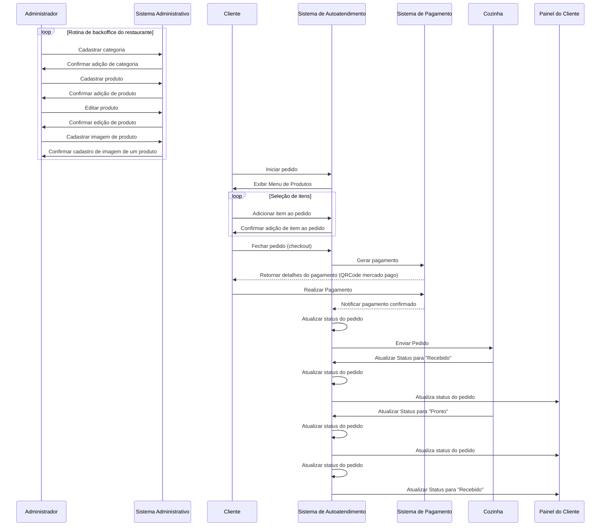

# Tech Challenge [Fase 2]

## Resultado no minikube


```bash
> kubectl get all
NAME                                    READY   STATUS    RESTARTS   AGE
pod/go-app-deployment-f6c9fcb67-n47vn   1/1     Running   0          22h
pod/restaurant-db-5ffddf874-j44sj       1/1     Running   0          5d21h

NAME                            TYPE        CLUSTER-IP     EXTERNAL-IP   PORT(S)          AGE
service/go-app-service          NodePort    10.107.79.74   <none>        8080:30000/TCP   5d20h
service/kubernetes              ClusterIP   10.96.0.1      <none>        443/TCP          20d
service/restaurant-db-service   ClusterIP   None           <none>        5432/TCP         5d21h

NAME                                READY   UP-TO-DATE   AVAILABLE   AGE
deployment.apps/go-app-deployment   1/1     1            1           22h
deployment.apps/restaurant-db       1/1     1            1           5d21h

NAME                                          DESIRED   CURRENT   READY   AGE
replicaset.apps/go-app-deployment-f6c9fcb67   1         1         1       22h
replicaset.apps/restaurant-db-5ffddf874       1         1         1       5d21h

NAME                                             REFERENCE                      TARGETS       MINPODS   MAXPODS   REPLICAS   AGE
horizontalpodautoscaler.autoscaling/go-app-hpa   Deployment/go-app-deployment   cpu: 1%/50%   1         5         1          23m
```

# Documentação do Projeto

Este documento detalha o desenho da arquitetura do sistema, elaborado para atender aos requisitos do negócio e às necessidades de infraestrutura.

`mermaid` que ilustra um diagrama de sequências, simples, que demonstra como a aplicação conseguirá resolver os problemas funcionais do projeto:



---

## 1. Requisitos do Negócio

O restaurante enfrenta problemas de performance nos seus totens de autoatendimento, que comprometem a experiência do usuário durante picos de demanda. Os principais objetivos da solução são:

- **Garantir disponibilidade** do sistema durante períodos de alta carga.
- **Reduzir o tempo de resposta** das requisições realizadas pelos totens.
- **Permitir escalabilidade automática** para lidar com flutuações no volume de requisições.

---

## 2. Requisitos de Infraestrutura

A arquitetura foi projetada para ser implantada em um cluster Kubernetes, podendo ser executada em:

- **Ambientes locais**, como Minikube ou Kind.
- **Provedores de nuvem**, como AKS (Azure), EKS (AWS), ou GKE (Google Cloud).

**Principais elementos da infraestrutura:**

- **Horizontal Pod Autoscaler (HPA):** Configurado para escalar automaticamente a aplicação "go-app" com base no uso de CPU, garantindo que os recursos sejam alocados conforme a demanda.
- **Secrets:** Utilizados para armazenar credenciais sensíveis, como a URL de conexão do banco de dados.
- **Banco de Dados PostgreSQL:** Implantado como um deployment com um PersistentVolumeClaim (PVC) para persistência de dados.
- **Aplicação em GO (atendendno os requisitos funcionais):** Implantado como um deployment que utiliza de um secrets para ter as credenciais de acesso ao Banco de Dados.
- **Services:** Configurados para expor a aplicação e o banco de dados, incluindo um NodePort para acesso externo à API.
- **ConfigMap:** Armazena configurações de aplicação não sensíveis, permitindo flexibilidade sem alterar a imagem do container.

---

## 3. Desenho da Arquitetura

### Representação Textual

1. **Aplicação (go-app):**
  - Uma API desenvolvida em Go, responsável por processar as requisições dos totens.
  - Configurada com um Deployment que especifica recursos mínimos e máximos para evitar sobrecarga.
  - Utiliza o HPA para escalar de 1 a 5 réplicas com base na utilização de CPU.
  - Verificação de saúde implementada com liveness e readiness probes.

2. **Banco de Dados (restaurant-db):**
  - PostgreSQL configurado com PVC para garantir a persistência dos dados.
  - ClusterIP Service utilizado para comunicação interna com a aplicação.

3. **Horizontal Pod Autoscaler (HPA):**
  - Monitora a métrica de utilização de CPU da "go-app" e ajusta dinamicamente o número de réplicas.

  Aqui podemos ver ele em funcionamento (ps: o computador que foi gravado dá um engargalada por conta do uso de memória, além de estar rodando no wsl e um minikube no docker com limitações), e para que funcionasse foi criado um shell script que exonera a api, aumentando o recurso consumido pelo container.

  https://github.com/user-attachments/assets/d3256bf6-6c33-4fbc-874c-7ae1f67006ba

4. **Secrets:**
   - Protegem informações sensíveis como a URL de conexão ao banco de dados. Estes dados são consumidos pela aplicação "go-app" via variáveis de ambiente. O Secret utilizado é:

  ```yaml
  apiVersion: v1
  kind: Secret
  metadata:
    name: go-app-secrets
  type: Opaque
  data:
    DATABASE_URL: cG9zdGdyZXM6Ly9wb3N0Z3Jlczpwb3N0Z3Jlc0ByZXN0YXVyYW50LWRiLXNlcnZpY2U6NTQzMi9maWFwX2Zhc3RfZm9vZD9zc2xtb2RlPWRpc2FibGU=
  ```

5. **Exposição de Serviços:**
  - NodePort para a "go-app" permite acesso externo na porta 30000.
  - O banco de dados é acessível internamente via ClusterIP.

### Diagrama da Arquitetura


---

## 4. Benefícios da Arquitetura

- **Escalabilidade Automática:** O HPA ajusta dinamicamente os recursos da aplicação conforme a carga.
- **Alta Disponibilidade:** Configurações de readiness e liveness probes garantem que apenas pods saudáveis recebam tráfego.
- **Segurança:** Uso de Secrets para proteger informações sensíveis.
- **Flexibilidade:** ConfigMaps permitem alterações rápidas nas configurações da aplicação sem necessidade de recriar imagens.
- **Persistência de Dados:** O banco de dados utiliza PVC para garantir que os dados sejam preservados mesmo em caso de falhas.

---

Este design assegura que a aplicação seja confiável, escalável e responsiva para atender aos desafios do restaurante.

---

## 5. Como rodar o cluster localmente

Para detalhes, consulte o arquivo [how-to-tun-k8s.md](./docs/how-to-run-k8s.md).

## 6. Collection com todas as APIs desenvolvidas com exemplo  de requisição (que não seja vazia)

- Para swagger, a documentação se encontra em `./swagger/* (tanto .json quanto o .yaml)`.
- Para postaman, a collection se encontra em `./postman/fiap_collection.json`.

## 7. como rodar a aplicação locamente

Para detalhes, consulte o arquivo [how-to-run.md](./docs/how-to-run.md).

## 8. Link para vídeo de demonstração

TO-DO.

## 9. Dados da arquitetura limpa e suas pastas aplicadas no projeto

Para detalhes, consulte o arquivo [infra.md](./docs/infra.md).

## 10. Informações relacionadas a fase 1

Para detalhes, consulte o arquivo [phase-1.md](./docs/old/phase-1.md).
